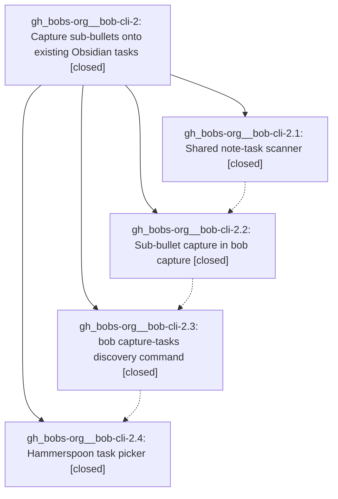

# Bead: gh\_bobs-org\_\_bob-cli-2 — Capture sub-bullets onto existing Obsidian tasks

[Bead Pages](../README.md) / gh\_bobs-org\_\_bob-cli-2

**Status:** ✓ closed · **Resolution:** done · **Type:** ▸ plan · **Tier:** epic
**Owner:** `bryanbugyi34@gmail.com` · **Assignee:** `gh_bobs-org__bob-cli-2.land`
**Created:** 2026-07-31 11:55:37 UTC · **Closed:** 2026-07-31 12:40:45 UTC
**Plan:** [202607/capture\_sub\_bullets.md](https://github.com/bobs-org/bob-cli--plans/blob/main/202607/capture_sub_bullets.md)

## Description

`bob capture` can append a sub-bullet to an existing Obsidian task via a new `@<route>^<block-id>` marker, `bob capture-tasks` lists a note's open tasks with their statuses, and the Hammerspoon capture panel resolves a bare `@<route>^` into a status-annotated task picker.

## Notes

[2026-07-31T12:40:45Z · gh_bobs-org__bob-cli-2.land] Children:
- gh_bobs-org__bob-cli-2.1
- gh_bobs-org__bob-cli-2.2
- gh_bobs-org__bob-cli-2.3
- gh_bobs-org__bob-cli-2.4
Implementation commits verified: 31a10c59, 0dc8d666, 851d7a16, 8831506c.
Source/acceptance coverage reviewed: tests/cli.rs capture_sub_bullet_errors_are_actionable_in_human_and_json_modes now includes invalid route-char and invalid block-ID-char cases and exercises both --human and --json modes.
Checks run: cargo test capture_sub_bullet_errors_are_actionable_in_human_and_json_modes --test cli, cargo fmt --check, git diff --check, and just all (ALL CHECKS PASSED).
Linked chezmoi checks run in commit 745988aa with clean checkout: just fmt-lua and just test-hammerspoon (14 successes / 0 failures).
Commit review after epic start: bob-cli range 31a10c59..HEAD reviewed for conflicts/duplication (31a10c59, 0dc8d666, 851d7a16, 8831506c only); chezmoi non-epic commit 0f8691c1 reviewed and judged non-conflicting; no further relevant commits landed while executing.
Created follow-up task bead: gh_bobs-org__bob-cli-3 to correct Pomodoro block-ID usage error wording mismatch (underscore claim).
No PROPOSED FOLLOW-UP entries were omitted because none existed on child bead histories.

## Phases

| Bead | Title | Status | Size | Agents | Commits |
|---|---|---|---|---:|---:|
| [gh\_bobs-org\_\_bob-cli-2.1](gh_bobs-org__bob-cli-2.1.md) | Shared note-task scanner | ✓ closed | medium | 1 | 1 |
| [gh\_bobs-org\_\_bob-cli-2.2](gh_bobs-org__bob-cli-2.2.md) | Sub-bullet capture in bob capture | ✓ closed | medium | 1 | 1 |
| [gh\_bobs-org\_\_bob-cli-2.3](gh_bobs-org__bob-cli-2.3.md) | bob capture-tasks discovery command | ✓ closed | medium | 1 | 1 |
| [gh\_bobs-org\_\_bob-cli-2.4](gh_bobs-org__bob-cli-2.4.md) | Hammerspoon task picker | ✓ closed | medium | 1 | 2 |

## Lineage

## Agents

| Agent | Bead | Commits |
|---|---|---:|
| [bbugyi200.athena.gh\_bobs-org\_\_bob-cli-2.1](https://github.com/bobs-org/bob-cli--agents/blob/main/agents/bbugyi200.athena.gh_bobs-org__bob-cli-2.1/README.md) | [gh\_bobs-org\_\_bob-cli-2.1](gh_bobs-org__bob-cli-2.1.md) | 1 |
| [bbugyi200.athena.gh\_bobs-org\_\_bob-cli-2.2](https://github.com/bobs-org/bob-cli--agents/blob/main/agents/bbugyi200.athena.gh_bobs-org__bob-cli-2.2/README.md) | [gh\_bobs-org\_\_bob-cli-2.2](gh_bobs-org__bob-cli-2.2.md) | 1 |
| [bbugyi200.athena.gh\_bobs-org\_\_bob-cli-2.3](https://github.com/bobs-org/bob-cli--agents/blob/main/agents/bbugyi200.athena.gh_bobs-org__bob-cli-2.3/README.md) | [gh\_bobs-org\_\_bob-cli-2.3](gh_bobs-org__bob-cli-2.3.md) | 1 |
| [bbugyi200.athena.gh\_bobs-org\_\_bob-cli-2.4](https://github.com/bobs-org/bob-cli--agents/blob/main/agents/bbugyi200.athena.gh_bobs-org__bob-cli-2.4/README.md) | [gh\_bobs-org\_\_bob-cli-2.4](gh_bobs-org__bob-cli-2.4.md) | 2 |
| [bbugyi200.athena.gh\_bobs-org\_\_bob-cli-2.land](https://github.com/bobs-org/bob-cli--agents/blob/main/families/bbugyi200.athena.gh_bobs-org__bob-cli-2.land.md) | [gh\_bobs-org\_\_bob-cli-2](README.md) | 2 |

## Commits

| Repo | Commit | Subject | Bead | Committed (UTC) |
|---|---|---|---|---|
| bob-cli | [`31a10c5`](https://github.com/bobs-org/bob-cli/commit/31a10c59c5c34dd0c8bd17377d7816ab1563db07) | feat(native): add shared note task scanner | [gh\_bobs-org\_\_bob-cli-2.1](gh_bobs-org__bob-cli-2.1.md) | 2026-07-31 12:04:56 |
| bob-cli | [`0dc8d66`](https://github.com/bobs-org/bob-cli/commit/0dc8d666f5c4542ac6df8ed81d2fb1d874257835) | feat(native): capture sub-bullets under existing tasks | [gh\_bobs-org\_\_bob-cli-2.2](gh_bobs-org__bob-cli-2.2.md) | 2026-07-31 12:15:06 |
| bob-cli | [`851d7a1`](https://github.com/bobs-org/bob-cli/commit/851d7a1601cef987bbff084bcb1c1a08061f7398) | feat(native): list open capture tasks | [gh\_bobs-org\_\_bob-cli-2.3](gh_bobs-org__bob-cli-2.3.md) | 2026-07-31 12:23:42 |
| chezmoi | [`chezmoi@745988a`](https://github.com/bbugyi200/dotfiles/commit/745988aa95e77f04ba85f6206fff7b3a3dfa02e8) | feat(hammerspoon): add capture task picker | [gh\_bobs-org\_\_bob-cli-2.4](gh_bobs-org__bob-cli-2.4.md) | 2026-07-31 12:31:32 |
| bob-cli | [`8831506`](https://github.com/bobs-org/bob-cli/commit/8831506cec0c420345947b45d40223bec5acf034) | docs(capture): document sub-bullet picker markers | [gh\_bobs-org\_\_bob-cli-2.4](gh_bobs-org__bob-cli-2.4.md) | 2026-07-31 12:32:02 |
| bob-cli | [`fafb07e`](https://github.com/bobs-org/bob-cli/commit/fafb07e2c23ab00e1b649840496b5aa96645d8ba) | test(cli): add malformed sub-bullet capture validation cases | [gh\_bobs-org\_\_bob-cli-2](README.md) | 2026-07-31 12:41:20 |
| bob-cli--plans | [`bob-cli--plans@b6dc784`](https://github.com/bobs-org/bob-cli--plans/commit/b6dc78429681c0ac3dd61b4618637b3d30e12957) | docs(plans): mark complete\_capture\_sub\_bullets epic as done | [gh\_bobs-org\_\_bob-cli-2](README.md) | 2026-07-31 12:42:29 |
