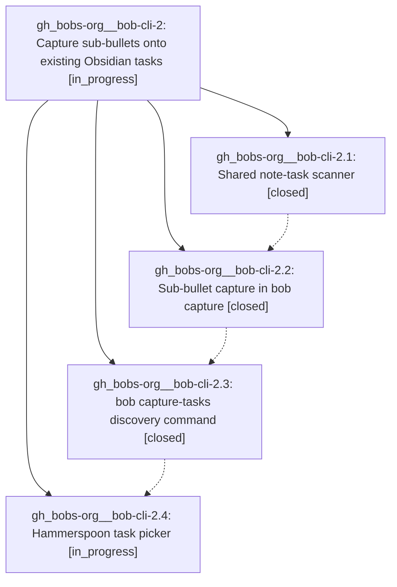

# Bead: gh\_bobs-org\_\_bob-cli-2 — Capture sub-bullets onto existing Obsidian tasks

[Bead Pages](../README.md) / gh\_bobs-org\_\_bob-cli-2

**Status:** ◐ in_progress · **Type:** ▸ plan · **Tier:** epic
**Owner:** `bryanbugyi34@gmail.com` · **Assignee:** `gh_bobs-org__bob-cli-2.land`
**Created:** 2026-07-31 11:55:37 UTC
**Plan:** [202607/capture\_sub\_bullets.md](https://github.com/bobs-org/bob-cli--plans/blob/main/202607/capture_sub_bullets.md)

## Description

`bob capture` can append a sub-bullet to an existing Obsidian task via a new `@<route>^<block-id>` marker, `bob capture-tasks` lists a note's open tasks with their statuses, and the Hammerspoon capture panel resolves a bare `@<route>^` into a status-annotated task picker.

## Phases

| Bead | Title | Status | Size | Agents | Commits |
|---|---|---|---|---:|---:|
| [gh\_bobs-org\_\_bob-cli-2.1](gh_bobs-org__bob-cli-2.1.md) | Shared note-task scanner | ✓ closed | medium | 1 | 1 |
| [gh\_bobs-org\_\_bob-cli-2.2](gh_bobs-org__bob-cli-2.2.md) | Sub-bullet capture in bob capture | ✓ closed | medium | 1 | 1 |
| [gh\_bobs-org\_\_bob-cli-2.3](gh_bobs-org__bob-cli-2.3.md) | bob capture-tasks discovery command | ✓ closed | medium | 1 | 1 |
| [gh\_bobs-org\_\_bob-cli-2.4](gh_bobs-org__bob-cli-2.4.md) | Hammerspoon task picker | ◐ in_progress | medium | 1 | 0 |

## Lineage

## Agents

| Agent | Bead | Commits |
|---|---|---:|
| [bbugyi200.athena.gh\_bobs-org\_\_bob-cli-2.1](https://github.com/bobs-org/bob-cli--agents/blob/main/agents/bbugyi200.athena.gh_bobs-org__bob-cli-2.1/README.md) | [gh\_bobs-org\_\_bob-cli-2.1](gh_bobs-org__bob-cli-2.1.md) | 1 |
| [bbugyi200.athena.gh\_bobs-org\_\_bob-cli-2.2](https://github.com/bobs-org/bob-cli--agents/blob/main/agents/bbugyi200.athena.gh_bobs-org__bob-cli-2.2/README.md) | [gh\_bobs-org\_\_bob-cli-2.2](gh_bobs-org__bob-cli-2.2.md) | 1 |
| [bbugyi200.athena.gh\_bobs-org\_\_bob-cli-2.3](https://github.com/bobs-org/bob-cli--agents/blob/main/agents/bbugyi200.athena.gh_bobs-org__bob-cli-2.3/README.md) | [gh\_bobs-org\_\_bob-cli-2.3](gh_bobs-org__bob-cli-2.3.md) | 1 |
| [bbugyi200.athena.gh\_bobs-org\_\_bob-cli-2.4](https://github.com/bobs-org/bob-cli--agents/blob/main/agents/bbugyi200.athena.gh_bobs-org__bob-cli-2.4/README.md) | [gh\_bobs-org\_\_bob-cli-2.4](gh_bobs-org__bob-cli-2.4.md) | 0 |
| [bbugyi200.athena.gh\_bobs-org\_\_bob-cli-2.land](https://github.com/bobs-org/bob-cli--agents/blob/main/agents/bbugyi200.athena.gh_bobs-org__bob-cli-2.land/README.md) | [gh\_bobs-org\_\_bob-cli-2](README.md) | 0 |

## Commits

| Repo | Commit | Subject | Bead | Committed (UTC) |
|---|---|---|---|---|
| bob-cli | [`31a10c5`](https://github.com/bobs-org/bob-cli/commit/31a10c59c5c34dd0c8bd17377d7816ab1563db07) | feat(native): add shared note task scanner | [gh\_bobs-org\_\_bob-cli-2.1](gh_bobs-org__bob-cli-2.1.md) | 2026-07-31 12:04:56 |
| bob-cli | [`0dc8d66`](https://github.com/bobs-org/bob-cli/commit/0dc8d666f5c4542ac6df8ed81d2fb1d874257835) | feat(native): capture sub-bullets under existing tasks | [gh\_bobs-org\_\_bob-cli-2.2](gh_bobs-org__bob-cli-2.2.md) | 2026-07-31 12:15:06 |
| bob-cli | [`851d7a1`](https://github.com/bobs-org/bob-cli/commit/851d7a1601cef987bbff084bcb1c1a08061f7398) | feat(native): list open capture tasks | [gh\_bobs-org\_\_bob-cli-2.3](gh_bobs-org__bob-cli-2.3.md) | 2026-07-31 12:23:42 |
