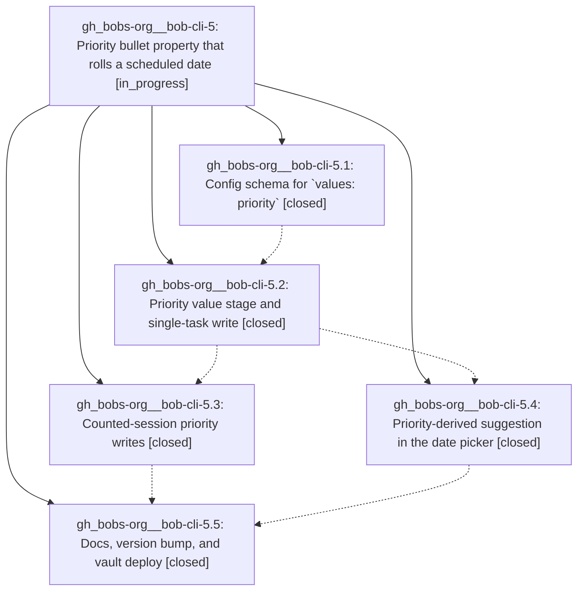

# Bead: gh\_bobs-org\_\_bob-cli-5 — Priority bullet property that rolls a scheduled date

[Bead Pages](../README.md) / gh\_bobs-org\_\_bob-cli-5

**Status:** ◐ in_progress · **Type:** ▸ plan · **Tier:** epic
**Owner:** `bryanbugyi34@gmail.com` · **Created by:** [bbugyi200.athena.s8](https://github.com/bobs-org/bob-cli--agents/blob/main/agents/bbugyi200.athena.s8/README.md) · **Assignee:** `gh_bobs-org__bob-cli-5.land`
**Created:** 2026-08-03 08:08:24 UTC
**Plan:** [202608/priority\_property.md](https://github.com/bobs-org/bob-cli--plans/blob/main/202608/priority_property.md)

## Description

The Ctrl+Shift+P bullet-property picker offers a `priority` property whose P2/P3/P4 levels each write a random `scheduled` date drawn from a per-level day range configured in bob/config.yml, and the `scheduled` date picker offers a visually distinct re-rollable date suggestion whenever the current task already has a priority.

## Phases

| Bead | Title | Status | Size | Agents | Commits |
|---|---|---|---|---:|---:|
| [gh\_bobs-org\_\_bob-cli-5.1](gh_bobs-org__bob-cli-5.1.md) | Config schema for \`values: priority\` | ✓ closed | medium | 1 | 2 |
| [gh\_bobs-org\_\_bob-cli-5.2](gh_bobs-org__bob-cli-5.2.md) | Priority value stage and single-task write | ✓ closed | medium | 1 | 1 |
| [gh\_bobs-org\_\_bob-cli-5.3](gh_bobs-org__bob-cli-5.3.md) | Counted-session priority writes | ✓ closed | medium | 1 | 1 |
| [gh\_bobs-org\_\_bob-cli-5.4](gh_bobs-org__bob-cli-5.4.md) | Priority-derived suggestion in the date picker | ✓ closed | medium | 1 | 1 |
| [gh\_bobs-org\_\_bob-cli-5.5](gh_bobs-org__bob-cli-5.5.md) | Docs, version bump, and vault deploy | ✓ closed | small | 1 | 1 |

## Lineage

## Agents

| Agent | Bead | Commits |
|---|---|---:|
| [bbugyi200.athena.gh\_bobs-org\_\_bob-cli-5.1](https://github.com/bobs-org/bob-cli--agents/blob/main/agents/bbugyi200.athena.gh_bobs-org__bob-cli-5.1/README.md) | [gh\_bobs-org\_\_bob-cli-5.1](gh_bobs-org__bob-cli-5.1.md) | 2 |
| [bbugyi200.athena.gh\_bobs-org\_\_bob-cli-5.2](https://github.com/bobs-org/bob-cli--agents/blob/main/agents/bbugyi200.athena.gh_bobs-org__bob-cli-5.2/README.md) | [gh\_bobs-org\_\_bob-cli-5.2](gh_bobs-org__bob-cli-5.2.md) | 1 |
| [bbugyi200.athena.gh\_bobs-org\_\_bob-cli-5.3](https://github.com/bobs-org/bob-cli--agents/blob/main/agents/bbugyi200.athena.gh_bobs-org__bob-cli-5.3/README.md) | [gh\_bobs-org\_\_bob-cli-5.3](gh_bobs-org__bob-cli-5.3.md) | 1 |
| [bbugyi200.athena.gh\_bobs-org\_\_bob-cli-5.4](https://github.com/bobs-org/bob-cli--agents/blob/main/agents/bbugyi200.athena.gh_bobs-org__bob-cli-5.4/README.md) | [gh\_bobs-org\_\_bob-cli-5.4](gh_bobs-org__bob-cli-5.4.md) | 1 |
| [bbugyi200.athena.gh\_bobs-org\_\_bob-cli-5.5](https://github.com/bobs-org/bob-cli--agents/blob/main/agents/bbugyi200.athena.gh_bobs-org__bob-cli-5.5/README.md) | [gh\_bobs-org\_\_bob-cli-5.5](gh_bobs-org__bob-cli-5.5.md) | 1 |
| [bbugyi200.athena.gh\_bobs-org\_\_bob-cli-5.land](https://github.com/bobs-org/bob-cli--agents/blob/main/agents/bbugyi200.athena.gh_bobs-org__bob-cli-5.land/README.md) | [gh\_bobs-org\_\_bob-cli-5](README.md) | 0 |

## Commits

| Repo | Commit | Subject | Bead | Committed (UTC) |
|---|---|---|---|---|
| bob-plugins | [`bob-plugins@8669c7e`](https://github.com/bobs-org/bob-plugins/commit/8669c7eab8fcb6a3ceb3fcba47e317e6b88004ed) | feat(navigation): validate priority property configuration | [gh\_bobs-org\_\_bob-cli-5.1](gh_bobs-org__bob-cli-5.1.md) | 2026-08-03 08:15:53 |
| chezmoi | [`chezmoi@c4d233b`](https://github.com/bbugyi200/dotfiles/commit/c4d233bb350f92377d02a1e754f992395a0947c3) | feat(bob): configure priority property levels | [gh\_bobs-org\_\_bob-cli-5.1](gh_bobs-org__bob-cli-5.1.md) | 2026-08-03 08:16:22 |
| bob-plugins | [`bob-plugins@ec7e0e4`](https://github.com/bobs-org/bob-plugins/commit/ec7e0e40e22e7599ea5199729fb03cc5dc41aeb7) | feat(navigation-hotkeys): add priority scheduling picker writes | [gh\_bobs-org\_\_bob-cli-5.2](gh_bobs-org__bob-cli-5.2.md) | 2026-08-03 08:28:12 |
| bob-plugins | [`bob-plugins@11ccbd5`](https://github.com/bobs-org/bob-plugins/commit/11ccbd520fb0eb6e3ae507f4be3a2dfa97f8818e) | feat(navigation): roll schedules for counted priority writes | [gh\_bobs-org\_\_bob-cli-5.3](gh_bobs-org__bob-cli-5.3.md) | 2026-08-03 08:36:12 |
| bob-plugins | [`bob-plugins@4a14aff`](https://github.com/bobs-org/bob-plugins/commit/4a14affc00d6c7e47561e5c822345b86b14ebfc1) | feat(navigation-hotkeys): suggest scheduled dates from priority | [gh\_bobs-org\_\_bob-cli-5.4](gh_bobs-org__bob-cli-5.4.md) | 2026-08-03 08:38:25 |
| bob-cli | [`3ae9819`](https://github.com/bobs-org/bob-cli/commit/3ae98193b2406d99e7481f2767545c39cf6e6076) | docs: document priority task property rolls | [gh\_bobs-org\_\_bob-cli-5.5](gh_bobs-org__bob-cli-5.5.md) | 2026-08-03 08:46:07 |
